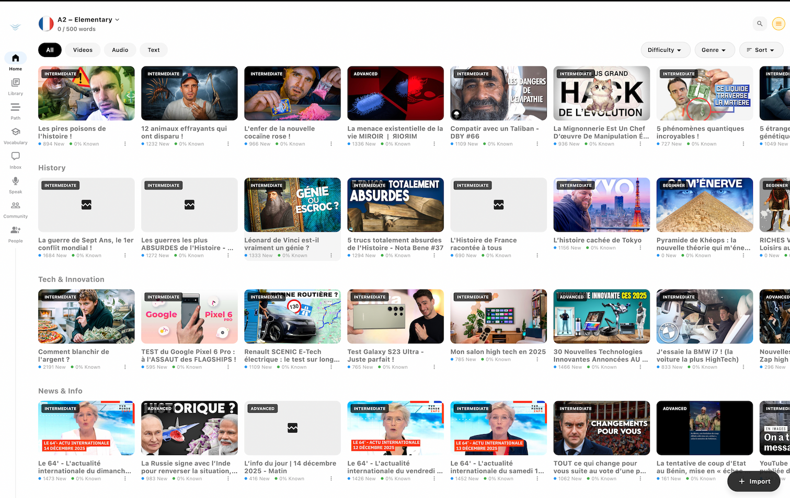

Learning a new language is a thrilling journey, but it can also be frustrating if you're using the wrong methods. In this article, we'll explore some of the most effective strategies to accelerate your progress.

## 1. Embrace Immersion
You don't need to move to another country to immerse yourself. Change your phone's language, listen to foreign podcasts, and watch movies without subtitles. The goal is to maximize your exposure.

*Learning through real-world content*

## 2. Leverage Spaced Repetition
Our brains are wired to forget. Spaced repetition systems (SRS) solve this by prompting you to review material just as you're about to forget it. This is a core component of how Fluly works.

## 3. Focus on High-Frequency Vocabulary
Don't waste time memorizing the words for rare animals or obscure tools. Focus on the 1,000 most common words, which make up about 80% of daily conversation.

## 4. Speak from Day One
Many learners wait until they feel "ready" before they start speaking. This is a mistake. Start speaking immediately, even if it's just repeating phrases aloud. Making mistakes is part of the process.

## 5. Consistency Over Intensity
Studying for 15 minutes every day is far more effective than cramming for 3 hours on Sunday. Build a daily habit.
