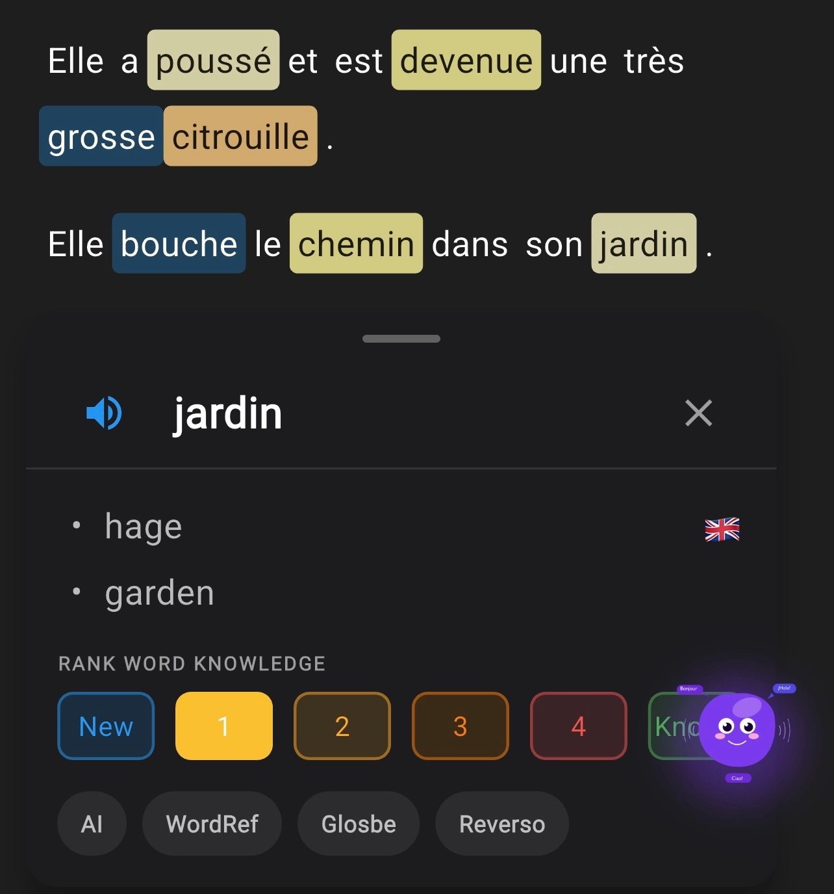

Summary: Do the immersion method at home, expose yourself to the language. That's all. Let's go deeper.

## What is the Immersion Method?

Immersion just means surrounding yourself in a language. That is through listening, reading, watching, and culture in a new language. For example, going to a new country where people speak a different language would require you to be immersed in it because you are surrounded by it everywhere. That is immersion, but you do not need to go to another country to be immersed in a language.

To fully understand the foundational concepts and how they lead to fluency, you should read our deep dive on [Immersion Language Learning](/blog/immersion-language-learning).

## How to Immerse Yourself in a New Language Without Going to Another Country

Someone will tell you to change your phone language to your target language. I say no, especially when you are just starting to learn a new language. Why? If you are using your phone and can't find the settings you want and you have to search every single time, in theory that would help you learn, but practically I do not think it does. It will just make you frustrated as you struggle to do basic things on your phone, which might make you hate the language. The main goal is to learn to love the language and enjoy the learning process.

Choose learning material you love. If you are really keen to change your phone language to your target language, do it when you have a good grasp and can understand the basics, or when you have reached intermediate level, because settings and menus use technical language that might contain words you do not know yet. There are better ways to immerse yourself and learn the language even faster.

It is simple really. Just do what native speakers do, but avoid things that will make you hate the language like changing your phone language or reading a very advanced book. Only do that when you can actually understand it.

Start by getting the basics down using apps like Duolingo. It will help with a few basics like "Bob is eating. He likes bananas. Yo como manzanas." Once you feel like you can say a little French or Spanish, move on from Duolingo and start the immersion method. Use content built for native speakers with apps like LingQ, Readlang, or our very own app [Fluly](/blog/why-fluly-beats-traditional-apps) to start immersing yourself in the language. The most important step here is to choose content you enjoy and find interesting, and to be able to understand around 70% to 80% of what you are consuming.

## What Apps to Use to Learn With the Immersion Method?

LingQ, Readlang, Language Reactor for YouTube, or our app Fluly. With Fluly you can import any local video or any YouTube video in your target language and use it to listen and learn. Import your favorite anime and use it to learn Japanese. You can also play word games to help with remembering and [pronunciation](/blog/mastering-pronunciation). Some people enjoy games, that's for them. 

If you like Anki, we also have a smart system that helps you remember words through [spaced repetition](/blog/importance-of-spaced-repetition). The algorithm is similar to Anki but honestly ours is better because it also links those words in context; it will show you which sentence you learned a word in. When you tap on new words in Fluly they are automatically saved to be reviewed which removes the hassle of saving words manually. It is just you enjoying the content, when you tap, it saves. Nothing else for you to do. The Fluly app is created with enjoyment in mind.

## The Mass Immersion Approach (MIA)

For those looking to take immersion to the absolute limit, the **Mass Immersion Approach** advocates for thousands of hours of passive and active listening before attempting to produce the language. 

The idea is that outputting (speaking or writing) too early can solidify bad habits. By just consuming massive amounts of media—often turning on subtitles in the target language and capturing sentences for your flashcards (sentence mining)—you build an incredibly robust, native-like intuition. Fluly is specifically built to enable sentence mining effortlessly by capturing the video frame, subtitle, and context simultaneously.

## Why the Immersion Method Works

The reason immersion works is simple. Your brain learns language the same way it learned your first language: through exposure and context, not memorization and grammar drills. When you hear or read something enough times in a real context, it starts to stick naturally. You are not forcing it, you are absorbing it.

Studies by linguist Stephen Krashen back this up. His input hypothesis says we acquire language best when we are exposed to content that is just slightly above our current level, what he calls i+1. Not too easy, not too hard. Just enough to keep your brain engaged and making connections. That is exactly what the immersion method does when done right.

The other reason it works is motivation. When you are learning from content you actually enjoy, a show you love, a podcast you find interesting, a book you would read anyway, you keep going. Consistency beats intensity every time. Fifteen minutes a day of content you enjoy will take you further than three hours of grammar exercises you dread.

*Fluly screen reader screenshot*